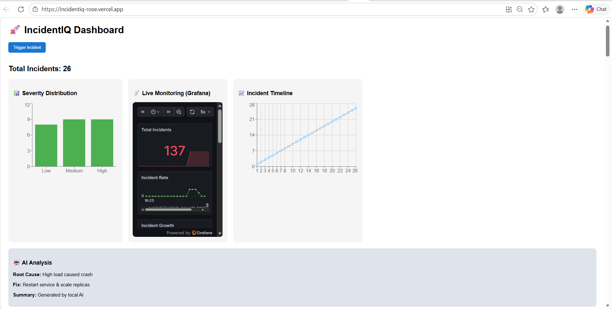
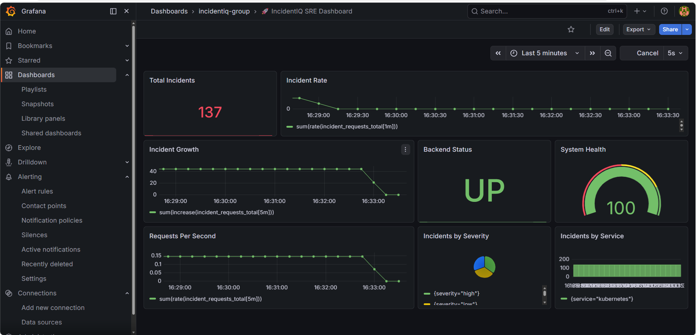

# 🚀 IncidentIQ — Production-Grade SRE Monitoring & Observability Platform

<p align="center">
  <b>Real-Time Incident Management • Observability • DevOps • System Design</b>
</p>

<p align="center">
  
  
  
  
  
  
</p>

<p align="center">
  ⭐ <b>If you like this project, give it a star!</b> ⭐
</p>

---

# 🌐 Live Demo

* 🚀 **Frontend (Vercel):** https://incidentiq-rose.vercel.app
* ⚡ **Backend (Render):** https://incidentiq-ryxt.onrender.com
* 📊 **Grafana Dashboard:** Embedded (real-time monitoring)

---

# 🧠 About the Project

**IncidentIQ** is a **production-style SRE (Site Reliability Engineering) platform** designed to simulate real-world incident monitoring and observability systems.

It demonstrates how modern systems:

* Detect incidents
* Analyze failures
* Monitor system health
* Visualize metrics
* Trigger alerts

---

# 🔥 Why This Project is Special

✅ Full-stack + DevOps integration
✅ Real observability pipeline (Prometheus + Grafana)
✅ Dockerized microservice architecture
✅ Production deployment (Vercel + Render)
✅ Embedded monitoring dashboards

> This is not just a project — it is a **mini SRE system**.

---

# 🏗️ System Architecture

```text
User (React Frontend - Vercel)
        ↓
FastAPI Backend (Render)
        ↓
Prometheus (Metrics Engine)
        ↓
Grafana (Visualization Layer)
        ↓
Alerting System (Slack / Email)
```

---

# ⚙️ Tech Stack

| Category      | Technology             |
| ------------- | ---------------------- |
| Frontend      | React.js, Recharts     |
| Backend       | FastAPI (Python)       |
| Monitoring    | Prometheus             |
| Visualization | Grafana                |
| DevOps        | Docker, Docker Compose |
| Deployment    | Vercel, Render         |
| Tunneling     | ngrok                  |

---

# 🚀 Features

## 🚨 Incident Management

* Manual incident triggering
* Severity classification (Low / Medium / High)
* Incident history tracking

## 📊 Observability

* Prometheus metrics collection
* Grafana dashboards (embedded)
* Real-time system monitoring

## 🤖 AI Analysis (Simulated)

* Root cause identification
* Fix recommendations
* Automated summaries

## 🎨 UI Dashboard

* Severity distribution charts
* Incident timeline visualization
* Clean and responsive interface

## 🐳 DevOps Ready

* Fully Dockerized setup
* One-command infrastructure setup

---

# ⚡ Quick Start

## 🔹 Clone Repo

```bash
git clone https://github.com/Pavankumar876232/incidentiq.git
cd incidentiq
```

---

## 🔹 Run Backend

```bash
cd backend
pip install -r requirements.txt
uvicorn api:app --reload
```

---

## 🔹 Run Frontend

```bash
cd frontend
npm install
npm start
```

---

## 🔹 Run Monitoring Stack

```bash
docker-compose up -d
```

---

## 🔹 Expose Grafana

```bash
.\ngrok.exe http 3000
```

---

# 📊 API Reference

| Endpoint     | Method | Description        |
| ------------ | ------ | ------------------ |
| `/event`     | POST   | Trigger incident   |
| `/incidents` | GET    | Get all incidents  |
| `/metrics`   | GET    | Prometheus metrics |
| `/health`    | GET    | Health check       |

---

## 📸 Demo Preview

### 🚀 Dashboard UI


### 📊 Grafana Monitoring


### Suggested:

* Dashboard UI
* Grafana embedded view
* Incident trigger flow

---

# 🔥 Real Workflow

```text
Trigger Incident → Backend Processing → Metrics Generated → Grafana Updates → UI Reflects Changes
```

---

# ⚠️ Important Notes

* Grafana is hosted separately (not on Vercel)
* ngrok URL changes on restart
* Anonymous access enabled for embedding

---

# 🏆 What This Demonstrates

* System Design (SRE architecture)
* Full-stack engineering
* Observability pipelines
* DevOps practices (Docker, deployment)
* Real-world monitoring workflows

---

# 💼 Resume Impact Statement

> Built a full-stack SRE monitoring system integrating React, FastAPI, Prometheus, and Grafana. Designed a real-time observability pipeline with Dockerized services and deployed across Vercel and Render.

---

# 🚀 Future Enhancements

* 🔴 WebSocket-based real-time updates
* 🧠 AI-powered anomaly detection
* ☁️ Cloud-native deployment (AWS/GCP)
* 🔔 Slack/Email alert integration UI
* 📊 Advanced Grafana dashboards

---

# 🤝 Contribution

Contributions are welcome! Feel free to fork and improve.

---

# ⭐ Support

If you found this useful:

👉 Star the repo
👉 Share with others

---

# 📜 License

MIT License

---

<p align="center">
  <b>Built with ❤️ by Pavankumar B</b>
</p>

---

# 🔥 FINAL NOTE

This project reflects **real engineering thinking**, combining:

```text
Frontend + Backend + Monitoring + DevOps + Deployment
```

👉 A strong **top-tier portfolio project** 🚀

---
